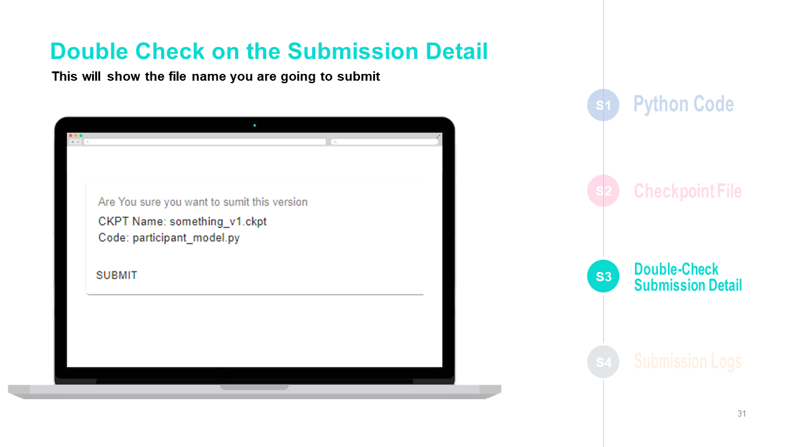

# 🧪 Model Training & Testing Guideline

## Download

### [Download the powerpoint](https://github.com/MindSporeChallenge21/resources/raw/main/Model%20Training%20%26%20Testing%20Guideline%20-%20Public.pptx)

## Slides

